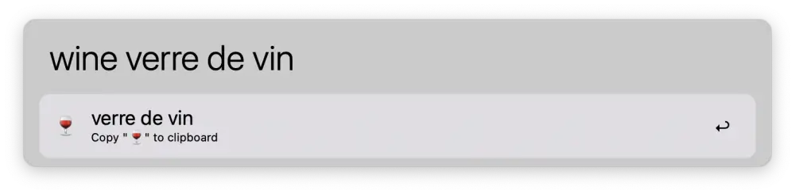
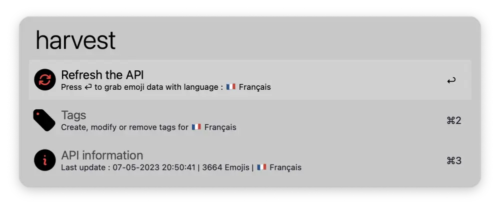

[](https://github.com/BenjaminOddou)
[](https://saythanks.io/to/BenjaminOddou)
[](https://www.python.org/downloads/macos/)

Welcome to the Alfred Emoji Wine repository: **An Alfred Workflow** ✨

## ✅ Prerequisites

* MacOS.
* Alfred 5. Note that the [Alfred Powerpack](https://www.alfredapp.com/powerpack/) is required to use workflows.
* Requires **python 3.7** or above.

## 🏎️ Data sources

This workflow combines multiple sources (see below) to build a local JSON API (`~/Library/Caches/com.runningwithcrayons.Alfred/Workflow Data/com.benjamino.emoji_wine`) along with an icons folder with base64 png images (≊1-4Ko per image).

List of sources :
* [Full list of latest emojis](https://unicode.org/Public/emoji/latest/emoji-test.txt) - Used to grab the full list of emojis
* [Classic emojis images](https://unicode.org/emoji/charts/full-emoji-list.html) - Used to grab list of classic emojis images
* [Skin Tone emojis images](https://unicode.org/emoji/charts/full-emoji-modifiers.html) -  Used to grab list of skin toned emojis images
* [CLDR Data files annotations](https://github.com/unicode-org/cldr/tree/main/common/annotations) - Used to translate of emojis titles and keywords
* [CLDR Data files annotations derived](https://github.com/unicode-org/cldr/tree/main/common/annotationsDerived) - Used to translate of emojis titles and keywords

## ⬇️ Installation

1. [Download the workflow](https://github.com/BenjaminOddou/alfred-emoji-wine/releases/latest)
2. Double click the `.alfredworkflow` file to install

## 🧰 Setup the workflow

Install Python 3.7 or above. Check your version with :

```shell
python --version
```

## 🧙‍♂️ Invoke the workflow

There is 2 flows in this workflow :

1. The first one allows you to display emojis. It can be triggered by writing `wine` keyword.
2. The second allows you to build the local api according the selected language. You can invoke this flow with the `harvest` keyword.

You can edit these triggers (flagged with a `🕹️` symbol) in the user configuration panel.

## 🤖 Usage of the workflow

### Setup variables

1. `🌐 Language` : select the language you prefer. Here is the full list of supported languages :

| Language        | ISO 639-1 | Emojipedia link |
| --------------- | --------- | --------------- |
| 🇬🇧 English    | en        | 🟢             |
| 🇫🇷 Français   | fr        | 🟢             |
| 🇪🇸 Español    | es        | 🟢             |
| 🇵🇹 Português  | pt        | 🟢             |
| 🇮🇹 Italiano   | it        | 🟢             |
| 🇩🇪 Deutsch    | de        | 🟢             |
| 🇳🇱 Nederlands | nl        | 🟢             |
| 🇳🇴 Norsk      | no        | 🟢             |
| 🇸🇪 Svenska    | se        | 🟢             |
| 🇩🇰 Dansk      | dk        | 🟢             |
| 🇮🇩 Melayu     | ms        | 🟢             |
| 🇨🇳 中文         | zh        | 🟢            |
| 🇯🇵 日本語        | ja        | 🟢            |
| 🇰🇷 한국어        | ko        | 🟢             |
| 🇮🇳 हिंदी      | hi        | 🔴              |
| 🇮🇳 मराठी      | mr        | 🔴              |
| 🇮🇳 తెలుగు     | te        | 🔴              |
| 🇧🇩 বাংলা      | bn        | 🔴              |
| 🇱🇰 தமிழ்      | ta        | 🔴              |

> All emojis aren't translated in all languages. Some languages doesn't have an emojipedia link.

If you wish to use another language, open a GitHub issue [here](https://github.com/BenjaminOddou/alfred-emoji-wine/issues/new).

1. `🎷 Notification sound` : personalize the sound of the workflow notification.

### Search an emoji

Trigger the workflow with `wine` keyword and search for an your emoji in the selected language.



### Workflow actions

1. Press ⏎ on the selected emoji to copy it to the clipboard.
2. Press ⌘⏎ on the selected emoji to paste it to the frontmost application.
3. Press ⌥⏎ on the selected emoji to copy its shortcut name (`:wine_glass:` ⇒ 🍷).
4. Press ⇧⏎ on the selected emoji to open its emojipedia page in the selected language.

### Refresh the API

Use the `harvest` keyword to display the local API info and to refresh it.




## ⚖️ License

[MIT License](LICENSE) © Benjamin Oddou
